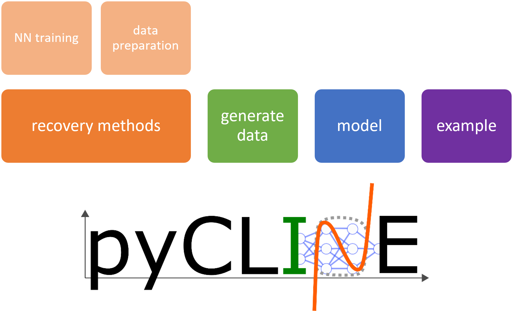

# PyCLINE - python package for CLINE

[](https://gitlab.kuleuven.be/gelenslab/publications/pycline/-/releases)
[](https://joss.theoj.org/papers/8e059d9f0ec762a3ff03d88699c911a0)
[](https://doi.org/10.5281/zenodo.17036387)
[](https://gitlab.kuleuven.be/gelenslab/publications/pycline/badges/main/pipeline)

The `pyCLINE` package is the python package based on the CLINE (**C**omputational **L**earning and **I**dentification of **N**ullclin**E**s).
It can be downloaded from PyPI with pip by using
    
    pip install pyCLINE

The package allows to recreate all data, models and results shown in [Prokop, Billen, Frolov and Gelens (2025)](https://arxiv.org/abs/2503.16240), and to apply CLINE to other data sets. 
In order to generate data used in [Prokop, Billen, Frolov and Gelens (2025)](https://arxiv.org/abs/2503.16240), a set of different models is being provided under `pyCLINE.model`. 
Data from these models can be generated using `pyCLINE.generate_data()`.
For setting up the data prepartion and adjacent training a neural network, the submodule `pyCLINE.recovery_methods` is used. 
The submodule contains the module for data_preparation `pyCLINE.recovery_methods.data_preparation` and for neural network training `pyCLINE.recovery_methods.nn_training`. 

For a better understanding, `pyCLINE` also contains the module `pyCLINE.example` which provides four examples also found in [Prokop, Billen, Frolov and Gelens (2025)](https://arxiv.org/abs/2503.16240) with step by step instructions on how to setup a CLINE pipeline. 

Documentation of the package can be found hosted on [Gitlab pages](https://pycline-ec8369.pages.gitlab.kuleuven.be).

The structure of `pyCLINE` is shown here: 
<!--  -->
<div style="text-align: center;">   
    
</div>

# Example of use

As mentioned before, in order to run several examples, the module `example` can be called

```python
import pyCLINE

pyCLINE.example(*example name*)
```

where example names are `FHN` (FitzHugh-Nagumo model), `Bicubic` (Bicubic model), `GeneExpression` (Gene expression) or `DelayOscillator` (Delay oscillator model) which are introduced in the manuscript. 
To reduce calculation times for the examples or test out alternative configurations, the examples can be run with a reduced number of epochs, increased batch size, reduced learning rate, or smaller network size by using the `epochs`,  `batch_size`, `lr`, `Nlayers`, `Nnodes` arguments respectively.
For example, to run the FitzHugh-Nagumo model with 100 epochs, a batch size of 128, a learning rate of 1e-3, 2 layers and 32 nodes per layer, the command would be:

```python
pyCLINE.example('FHN', epochs=100, batch_size=128,lr=1e-3, Nlayers=2, Nnodes=32)
```

Additionally, below you can find the example for the use of the FitzHugh-Nagumo (FHN) model without the use of  `pyCLINE.example`.
After installing the package, we import `pyCLINE` as well as `torch.nn` to be able to configure the activation function for the neural network training. 
Additionally, we load `pandas` to be able to load generated test data sets.

```python
import pyCLINE
import torch.nn as nn
import pandas
```

Firstly, we start by generating the FHN data set, which we then can load as a Pandas Dataframe back into the file from the created data directory:

```python
pyCLINE.generate_data.FHN(dt=0.1, N=1000000, epsilons=[0.3], n_intiaL_conditions=1)
df = pd.read_csv('data/synthetic/FHN_eps=0.3_a=0.0)
```

This prepared Dataframe consists of many simulations from randomly selected initial conditions, but we just want to use a single one and reset the index of the dataframe. 

```python
df_sim = df[(df['sim']==1)].copy()
df_sim.reset_index(drop=True, inplace=True)
```

This step can be skipped when using a single simulation with your data when you only have a single time series.
After this we can prepare the data for training, where we declare the column names with a set of parameters used to normalize the data:

```python
df_sim, df_coef = pyCLINE.recovery_methods.data_preparation.prepare_data(df_sim, vars=['u', 'v'], time='time', tmin=10, scheme='derivative', value_min=0.0, value_max=1.0)
```

We then can define the variables that will be used as input and output/target variables of the neural network, and split the datasets into training, test and validation:

```python
input_train, target_train, input_test, target_test, input_val, target_val = pyCLINE.recovery_methods.data_preparation.shuffle_and_split(df_sim, input_vars = input_vars, target_var = target_vars, optimal_thresholding=False)
```

With the prepared data, we can set up the model and train it:

```python
#set up
nn_model,  optimizer, loss_fn = recovery_methods.nn_training.configure_FFNN_model(Nin=len(input_vars), Nout=len(target_vars),Nlayers=3, Nnodes=64, summary=True, lr=1e-4, activation=nn.SiLU)

#training
training_loss, val_loss, test_loss, predictions_evolution, lc_predictions, _ = recovery_methods.nn_training.train_FFNN_model(model=nn_model, optimizer=optimizer, loss_fn=loss_fn, input_train=input_train,target_train=target_train,input_test=input_test, target_test=target_test, validation_data=(input_val, target_val), epochs=3000, batch_size=64, device='cpu',save_evolution=True,method='derivative', minimal_value=val_min,maximal_value=val_max)
```

The result of the training are the losses and the predictions of the limit cycle (`lc_predictions`) and nullcline predictions (`predictions_evolution`) over the set amount of epochs, which can be used to visualize the outcome of the nullcline predictions. 

# Contributing to pyCLINE

If you want to contribute to the `pyCLINE` package, you can do it so here on Gitlab when having a Gitlab account or on [Github](https://github.com/BMP-TUD/pyCLINE) with the repository feature by creating a issue either for bug reports or suggestions. 

If you have already written code to fix bugs or add extensions then feel free to create a pull request, however before putting substantial effort into major code changes please open an issue to discuss it. 